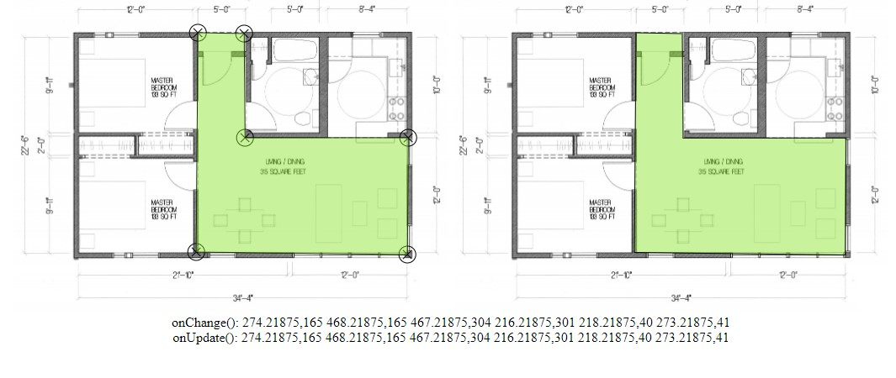

# lasso-canvas-image

Polygon selecting tool for HTML5 Image Element



## Instalation

```bash
npm i lasso-canvas-image
```

## Usage

```js
// ES6 modules with Babel or TypeScript
import createLasso from 'lasso-canvas-image';

// CommonJS modules
const createLasso = require('lasso-canvas-image');

// Init
const lasso = createLasso({
  element: document.querySelector('img'),
  radius: 10,
  onChange (polygon) {
    console.log('Selection area changed: ' + polygon);
  },
  onUpdate (polygon) {
    console.log('Selection area updated: ' + polygon);
  }
});

// Methods
lasso.reset();
```

## Examples

Check out this [example](tests/index.html)

## Syntax

```ts
function createLasso ({
  element: HTMLImageElement;
  radius?: number;
  onChange?: (polygon: string) => void;
  onUpdate?: (polygon: string) => void;
})
```

Options

- `element` DOM HTMLImageElement Instance
- `radius` The radius of the circle's dots on the canvas
- `onChange` Runs when the selected area is updated or points are moved by the user
- `onUpdate` Runs when the selected area is updated
